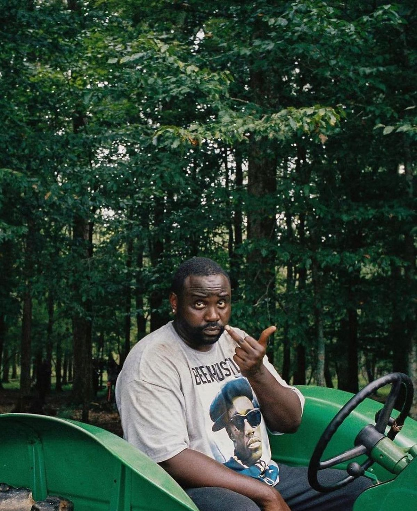
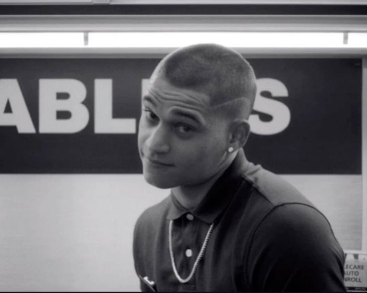

I consumed some media in a surreal order, never correlating them along. Someone asked me over some picantes what makes Atlanta so special. "It's a show about rappers," they said. I couldn't explain it. I only knew how it felt.

The same way I felt Get Out. The same way I experienced Sorry to Bother You.

In Ep 1, a strange man offers Glover a sandwich. Glover politely declines. The man walks into the dread of the forest. The world seems strange yet truly believable, not because the sandwich man exists, but because nobody else seems to notice him. The bizarre is treated with the same indifference as bad weather. The weird doesn't interrupt reality, it has become a part of it. Multiple times the lead looks around, searches, maybe tries to look at us through the screen. But soon accepts it. He has rent to pay after all.

The "blackness" of the show begs the question, what separates it from narcotic-driven European surrealism. The Lobster, Poor Things, Mulholland Drive, these feel like hallucinations. Atlanta feels uncomfortably present and real. Where Yorgos hypnotises, Glover normalises. The reality doesn't bend, it just refuses to explain itself.

I didn't recognize Atlanta because I understand black America. I recognized it because I too come from a place where reality rarely explains itself. We scan QRs at ancient temples. We ask AI to explain epics. No one stops to ask how we got here. Rent still remains due.

Miller, in his manifesto for the Afrosurreal movement, drives the point that the absurd exists within us, and it is our job to uncover it. The marginalized don't need drugs or dreams to access the surreal, because surreal is the baseline condition of their existence.

This is where Atlanta splits from its own cousin, Afrofuturism. Afrofuturism dreams prosperity, Afrosurreal doesn't. MF DOOM rarely preached about Wakanda. UFOs are absent from Basquiat's presentation. There is no escape hatch, no cosmic scale, no better world hiding behind this one. Atlanta interests itself in the mundane instead. The absurd isn't a door out of the condition, it is the condition.

We rarely pause, and neither does the show. The absurdity is never discussed. Survival becomes forefront, curiosity takes the back seat. The world order is not discussed the way it is in Bugonia, taking a loan for the next date night is. We wanted answers in Mulholland Drive. We want the rent to be paid in Atlanta.

Identity and resilience remain core, but we are constantly asked to adapt instead of question. In Atlanta, everyone adapts. Invisible cars run over people, life goes on. Institutions persecute, it becomes a story on the radio followed by the paper boi song. Cultures are appropriated, struggles are stolen. Scholarships depend on performing the right identity. Something impossible happens every day, and rarely anyone notices.

So if I am still able to answer this over another round of picantes, I'd say this, Atlanta was never a show about rappers. It's a show about what it feels like when the impossible happens and you still have somewhere to be.

*ref: [Afrosurreal Manifesto](https://www.foundsf.org/Afrosurreal_Manifesto)*
