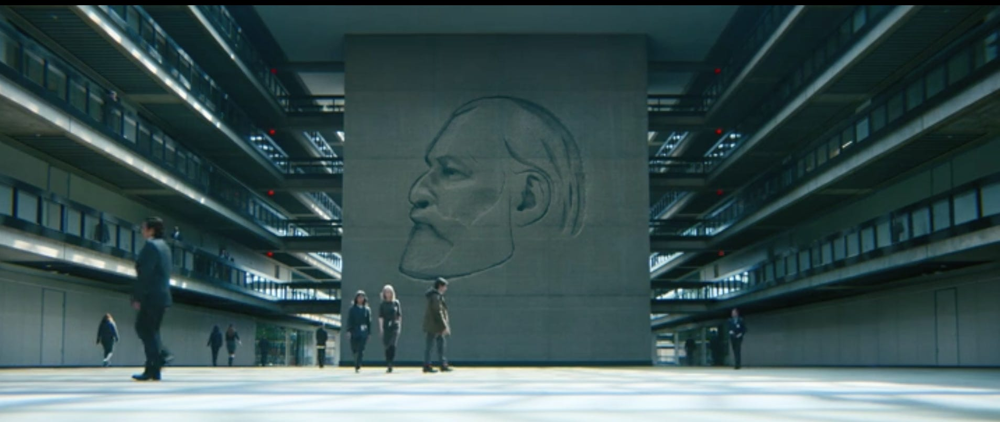
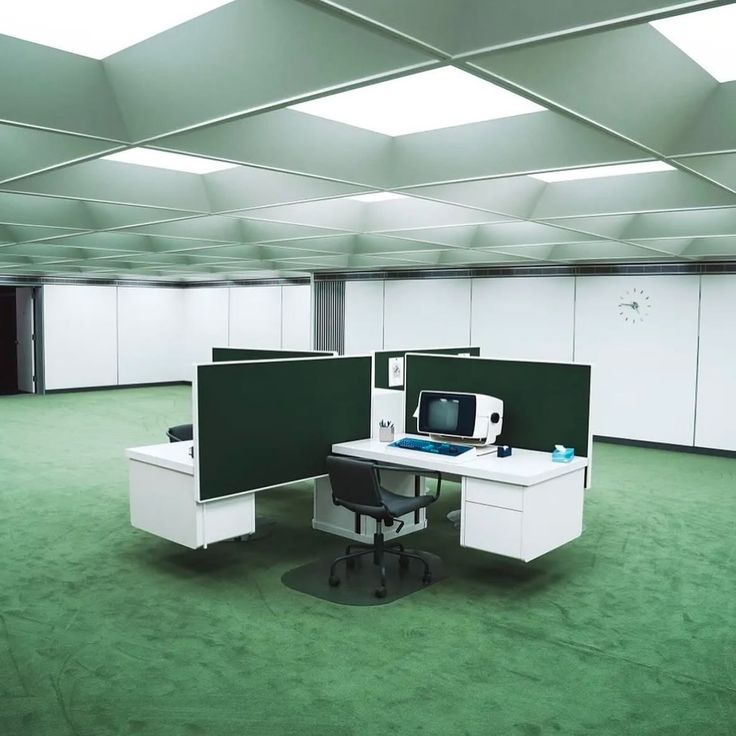

Severance is a dystopian sci-fi TV series about a group of people who undergo a medical procedure that splits their consciousness so that one "self" only works, while the other only enjoys leisure time. The "real" person retains their memories, but the "severed" self doesn't remember anything about the outside world.

One quote echoed throughout the first season of *Severance*:
> "The work is mysterious and important."

I often find myself relating to it to some degree. Most days, I know my work matters. Or at least, I'm told it does. It fills time, demands attention, and carries a sense of urgency that's hard to question in the moment.

There is some beauty in the abstraction of a "need to know basis". It rarely rears its head during the 10am lock-in until the time the collective log-out happens. It's almost like stepping into the elevator in *Severance*.

I know I worked today.  
I know it was important.  
I'm not sure I wanted to do it.

It's not an accidental feeling to have, neither is it a new one. But it somehow makes its way through to you, and rather quickly. You sit around things you don't believe in day in, day out, agree to decisions you didn't make. I find myself typing out *"sounds good"* without even grasping the first consequence of the decision being made. This is not you being dishonest, it is just what work models us to become.

Festinger coined the term cognitive dissonance for the experience of holding two opposing ideas at once. It's the moment when you tell yourself you should wake up early, and still hit snooze without thinking. When have most of us written a work email with our entire conviction? The interesting part is how rarely this discomfort is resolved. You adjust to it and, over time, instead of resolving it, you start to dissociate your work self from the rest of who you are.

While Festinger talked about the separation of one from their work self, Marx, well before all of this, talked about the concept of alienation, which to me completely resonates with what the show is getting at. Fun fact: the name of the main lead is Mark S. → Marx. We are not only alienated from the product we work on, but from the act of working itself. The idea that what you produce, and why you produce it, begins to feel external, almost separate from you. The work may be yours, but it doesn't feel like it belongs to you. And over time, neither does the part of you that does it.

In the show, the separation is made literal. The "innie" performs the labour, cut off from any sense of purpose or outcome. The "outie" lives outside of it, equally disconnected from what the work actually is. Each is alien to the other. But outside the show, the split isn't as clean. You are both the "innie" and the "outie" at once.

Which brings up an uncomfortable question.  
**What if the problem isn't the split?**

There's a natural instinct to think in terms of fixing it, of somehow becoming whole again. To imagine a version of ourselves where the one who works and the one who reflects are perfectly aligned. Where what we do and why we do it finally make complete sense together.

But Hegel disagrees, suggesting something more unsettling. That contradiction isn't a flaw to eliminate, it's a condition we operate within. The self was never as unified as we like to believe. Every choice, every role, every version of us that shows up somewhere comes at the cost of another. Something is always left out.

You might order a taster menu on a night out with the boys, finally settle on that wheat beer for the night, but there exists a version of you that never got to experience the stout that day. You missed out on the stout-specific conversations, stout-specific life moments. Every decision affirms one version of you, and quietly erases another. It sounds dramatic and whimsical for a beer. It scales up.

From that perspective, alienation isn't just something imposed on us by work. It might be something more fundamental, a consequence of being able to choose, to act, to become anything at all.

Which makes *Severance* harder to dismiss.  
Because it doesn't just show a broken system.  
It shows a system that makes visible something we've already learned to live with.

